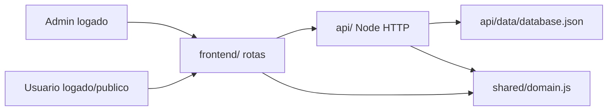

# Arquitetura

## Fluxo

## Decisoes

- O backend ativo esta em `api/`; a pasta `backend/` ficou como legado Django da tentativa anterior.
- A API nao usa pacotes externos. Isso facilita rodar localmente no Windows sem instalacao extra.
- O banco e JSON local, suficiente para o projeto for-fun e facil de trocar por SQLite/PostgreSQL depois.
- A pontuacao fica centralizada em `shared/domain.js`, usada pelo backend e pelo frontend.
- O frontend esconde o admin para usuario comum, e a API reforca a regra com token e role `admin`.
- Previsoes so podem ser criadas para corrida/sprint sem resultado cadastrado.

## Endpoints

- `GET /api/health`
- `GET /api/meta`
- `GET /api/snapshot`
- `GET /api/teams`
- `GET /api/drivers`
- `GET /api/events`
- `GET /api/standings`
- `POST /api/auth/register`
- `POST /api/auth/login`
- `GET /api/auth/me`
- `POST /api/auth/logout`
- `POST /api/predictions`
- `GET /api/predictions/me`
- `DELETE /api/predictions/:id`
- `GET /api/predictions/leaderboard`
- `POST /api/teams`
- `PUT /api/teams/:id`
- `POST /api/drivers`
- `PUT /api/drivers/:id`
- `POST /api/events`
- `PUT /api/events/:id`
- `POST /api/results`
- `DELETE /api/results/:id`

Rotas de escrita de equipes, pilotos, etapas e resultados exigem `Authorization: Bearer <token>` de um usuario com role `admin`.
